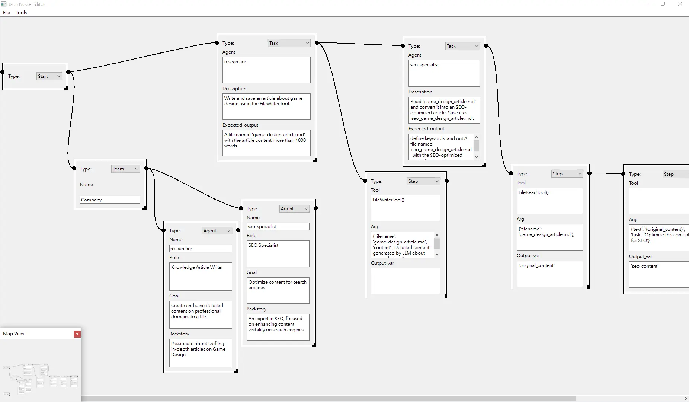

# CrewAI-GUI
crewai frontend gui.

This is node based gui for crewai frontend. that will export to json for better decoupling.



### video introduce
[https://www.youtube.com/P5tkYJ-AgSc](https://youtu.be/P5tkYJ-AgSc)

### Limitation

Current node types and slots are limited.

Not all crewai var or features have imp the path.

## Environment

### front-end GUI
```
pip install PySide6
```

### back-end
```
pip install 'crewai[tools]' langchain crewai

```

## Usage

### front-end GUI

run

```
python frontend.py
```
and you can read and write json file as DAG graph for crewai.

### back-end

base on gpt4 api key or ollama

if gpt4 run

```
python backend.py --graph example.json --keys credentials.ini --tee output.log
```

if local run such phi3

```
python backend.py --graph example.json --llm phi3 --tee output.log
```
it will parse json file into crewai tasks and agents


## Build
### front-end GUI
remember hook for qt6
```
pip install pyinstaller

pyinstaller --onefile --additional-hooks-dir=. frontend.py
```
